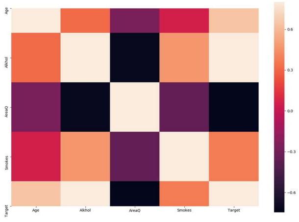
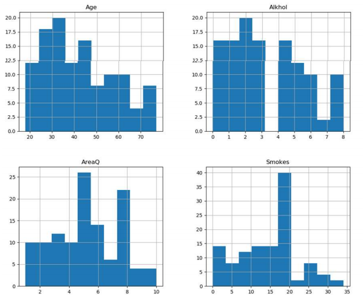

## Lung cancer early detector
#
This project was developed for fundamentals of biological systems. The aim of the project was to develop a cure/detection for lung cancer with biomimesis. The developed proposal uses neural networks for a binary classifier to detect cancer on early stages based on a non invasive method where the only requiered analysis is a torax radiography.</br>

_***Disclaimer:*** This model has not been proved to work on real new data, any use of the model to diagnose cancer is up to the user and the creator doesn't hold any responsibility. This project was developed as a proof of concept for the use of machine learning in cancer detection._
### Solution
This project proposes to create a method for
the classification of individuals with a tendency
to develop cancer cells through
An artificial intelligence prediction. Be
binary classification methods to
from a model with neural networks and
cross validation This in order to create and
train models that can classify with
precision the tendency of a patient to
suffer from lung cancer. This was done due to the direct and linear correlation of the variables.

<p align="center">

</p>


This program receives the following input:
- Name
- Last name
- Age
- Lung area
- Alcohol intake
- Smoking intake

It outputs a binary result
- 0 => No cancer
- 1 => Cancer detected


### Dataset
The dataset used for this classifier is called Lung cancer DataSet from Yusuf Dede (
2018-12-01)</br>
<p align="center">

</p>

It can be download with the following addition to the code:
```
kaggle datasets download -d yusufdede/lung-cancer-dataset
```

### Compatibility and requirements
- Python 3.7.4
- Keras
- Pandas
- Sklearn
- Tensorflow*</br>
_*GPU (min: GTX 1060) is recommended for better performance_

### Academic paper
[Download](Predicción_de_tendencia_al_desarrollo_de_células_cancerosas_con_inteligencia_artificial.pdf)
### Download
[Download](binaryclassify.py)